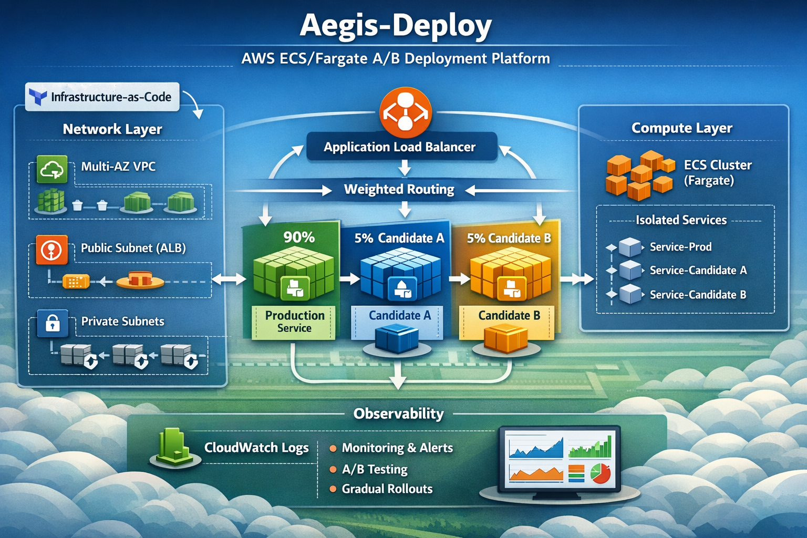
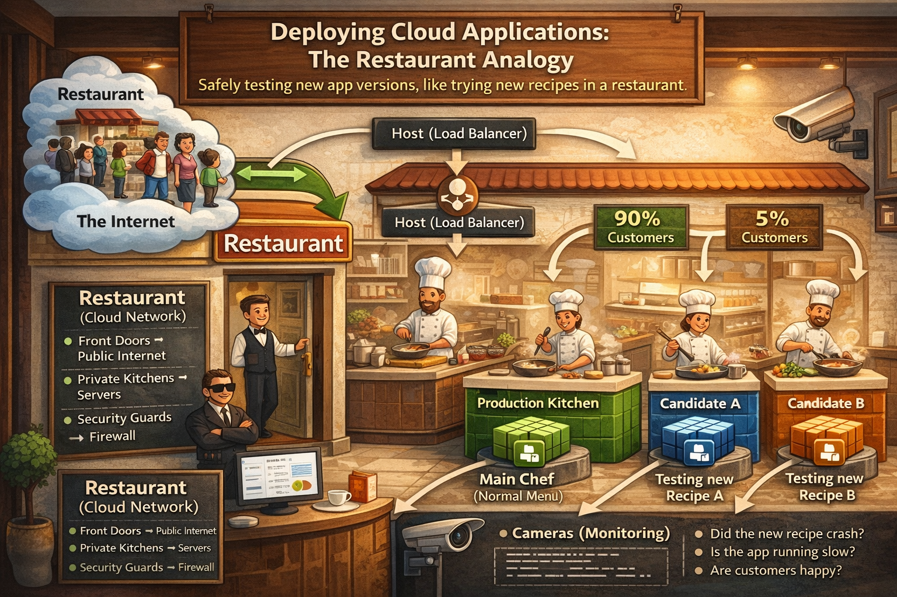

# Aegis-Deploy

Production-Style AWS Deployment Platform for Safe Rollouts

Aegis-Deploy is a Terraform-based cloud infrastructure project designed to simulate how modern companies safely deploy new application versions using **canary deployments and A/B testing**.

The platform provisions a **multi-AZ AWS environment running three isolated ECS/Fargate services behind an Application Load Balancer with weighted traffic routing.**

This allows safe experimentation with new versions while protecting production traffic.

---

# Architecture

The architecture uses AWS ECS with Fargate to run containerized applications across multiple availability zones.

Traffic is distributed using an Application Load Balancer that can dynamically shift traffic between service versions.

This architecture demonstrates a **safe deployment strategy used by modern cloud platforms.**

---

# Restaurant Analogy

Imagine a restaurant testing new recipes.

Customers enter through a host who directs most people to the **main kitchen**, while sending a small number to **experimental kitchens** testing new dishes.

Traffic distribution might look like this:

| Service | Traffic | Purpose |
|-------|-------|-------|
| Production | 90% | Stable application version |
| Candidate A | 5% | Experimental deployment |
| Candidate B | 5% | Experimental deployment |

If a new version performs well, traffic can gradually shift toward it.

If something fails, traffic can instantly revert to production.

---

# Key Architecture Concepts Demonstrated

This project demonstrates several important cloud architecture concepts:

- Infrastructure-as-Code using Terraform
- Multi-AZ VPC architecture
- ECS container orchestration
- Application Load Balancer traffic routing
- Canary deployments
- A/B testing
- Observability using CloudWatch

These techniques are commonly used in production systems to reduce deployment risk.

---

# Infrastructure Stack

Cloud Services:

- AWS VPC
- AWS ECS (Fargate)
- AWS Application Load Balancer
- AWS IAM
- AWS CloudWatch

DevOps Tools:

- Terraform
- Docker
- GitHub

---

# Project Structure
